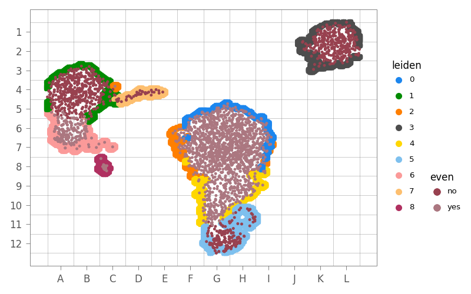
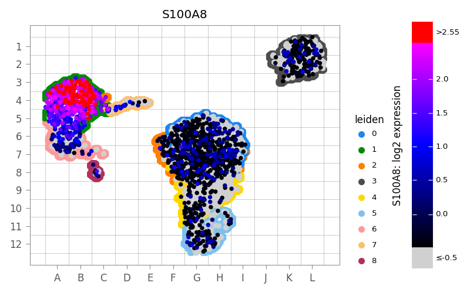

# mbf-singlecell-plotter

Publication-quality scatter plots for single-cell RNA-seq embeddings.

Built on [plotnine](https://plotnine.org) and
[AnnData](https://anndata.readthedocs.io), the library provides a fluent
builder API that covers the full rendering pipeline — gene expression,
clipped color bars, cluster annotations, cell-type boundary overlays, 
grid coordinates, density heatmaps, and grid-local histograms — 
while keeping plots from different experiments
visually comparable via fixed panel sizes.

| Categorical | Numerical |
|---|---|
|  |  |

---


## Quick start

```python
import anndata
from mbf_singlecell_plotter import ScatterPlotter

ad = anndata.read_h5ad("my_data.h5ad")
plotter = ScatterPlotter().set_source(ad, embedding="umap")

# Gene expression
plotter.plot("S100A8").save("s100a8.png")

# Categorical annotation
plotter.plot("leiden").save("leiden.png")

# Cell density
plotter.plot_density().save("density.png")
```

`ScatterPlotter` is an **immutable builder** — every method returns a new copy,
so a base plotter can be safely reused and extended.

---

## Builder API

### Data source

```python
ScatterPlotter(base_size=12)
plotter.set_source(ad_or_data, embedding="umap")
```

`embedding` can be a key in `ad.obsm` (`"umap"` → `"X_umap"`) or a tuple for two PCA components:
```python
plotter.set_source(ad, embedding=("pca", 0, 1))
```

---

### Visual style

```python
plotter.style(
    dot_size=3,           # scatter-dot radius
    legend_dot_size=4,    # dots inside the legend
    panel_border=True,    # draw a border around the plot panel
)
```

---

### Colormap (numerical data)

```python
plotter.colormap(
    cmap=["#000000", "#0000FF", "#FF00FF"],  # list of colors (gradient), or matplotlib cmap
    max_quantile=0.95,     # values above this quantile are clipped
    upper_clip_color="#FF0000",  # color shown for clipped values
    title="log2 expr",     # custom colorbar title (None → '<gene name> log2 expression')
)
```

### Colormap (categorical data)

```python
# Positional list (cycles if there are more categories than colors)
plotter.colormap_discrete(["#E41A1C", "#377EB8", "#4DAF4A"])

# Or a dict for explicit mapping
plotter.colormap_discrete({"T cell": "#E41A1C", "B cell": "#377EB8"})
```

---

### Zero-value handling

Cells with zero expression are rendered as a separate (lower) layer so they do
not drown out the color gradient.

```python
plotter.zeros(
    color="#D0D0D0",   # color for zero dots (default: light grey)
    dot_size=3,
    max_zero_value=0.0,    # threshold treated as "zero"
)
```

---
### Outliers (categorical) 

By default, we take the 5% of each category that's the farthest
from the mean position within the category (euclidean distance), 
and plot them on top. This helps highlight bad labeling.

Adjust jusing

```python
plotter.outliers(
    shape = 'x',
    # points are outlier if they're *above* this quantile
    quantile = .95,
)
```

---

### Layer visibility

You can toggle each layer individually on / off

```python
plotter.layers(
    data=True,       # main scatter layer
    zeros=True,      # zero-expression lower layer
    borders=True,    # cell-type boundary underlay
    outliers=True,   # outlier re-plot pass (categorical only)
)
```

---

### Cell-type boundaries

Gaussian-blurred masks are computed per cell type and boundaries are traced as contour lines.

```python
plotter.with_borders(
    cell_type_column="leiden",
    size=15,           # boundary dot size
    resolution=200,    # rasterisation resolution
    blur=1.1,          # Gaussian blur σ
    threshold=0.95,    # contour threshold
    legend=True,
    legend_title="Cell type",
)

plotter.without_borders()   # disable
```

---

### Grid overlay

A 12 × 12 (configurable) coordinate grid with alphanumeric labels — useful for
spatial reference across figures.

Default is to have the grid enabled.

```python
plotter.with_grid(
    labels=True,            # draw "A1", "B3" … inside each cell
    coords=True,            # replace axis ticks with grid coordinates
    vertical_letters=False, # True → letters on y-axis, numbers on x-axis
    grid_size=12,           # cells per axis (max 26)
    color="#777777",
    label_color="#777777",
)

plotter.without_grid()   # disable
```

---

### Fixed panel size

Fixes the **data area** (the actual scatter region, excluding legend and
labels) to exact dimensions in inches. Figure size adjusts to fit the
decorations, so plots with different legends remain directly comparable.

```python
plotter.panel_size(width=3.0, height=3.0)
```

Works for both `.plot()` and `.plot_grid_histogram()`.

---

### Viewport

```python
plotter.focus_on(x=(x_min, x_max), y=(y_min, y_max))
plotter.focus_on_grid("G3", "H12")
plotter.unfocus()
```

---

### Faceting

```python
plotter.facet("batch", n_col=3)
plotter.unfacet()
```

---

### Title

```python
plotter.title("My custom title")  # or None to suppress
```

---

## Terminal methods

```python
# Scatter plot (auto-detects numerical vs. categorical)
p = plotter.plot("S100A8")
p = plotter.plot("leiden")

# 2-D cell density heatmap
p = plotter.plot_density(bins=200, quantile=0.99)

# Grid-local category frequency histogram
p = plotter.plot_grid_histogram("leiden", min_cell_count=10)

```

All terminal methods return a `plotnine.ggplot` object; call `.save()` on it or
pass it to any plotnine-aware function.

---

## Recipes

### Numerical plot with boundaries and grid

```python
plotter = (
    ScatterPlotter()
    .set_source(ad, embedding="umap")
    .style(dot_size=2)
    .with_borders(cell_type_column="leiden")
    .with_grid(labels=True)
    .zeros(zero_value=-0.5)
    .colormap(max_quantile=0.99)
)

plotter.plot("S100A8").save("s100a8_full.png")
```

### Consistent panel size across multiple genes

```python
base = (
    ScatterPlotter()
    .set_source(ad)
    .style(dot_size=2)
    .panel_size(3.0, 3.0)
)

for gene in ["S100A8", "LST1", "CST3"]:
    base.plot(gene).save(f"{gene}.png")
```

### Faceted plot per cluster

```python
(
    ScatterPlotter()
    .set_source(ad)
    .facet("leiden", n_col=3)
    .style(dot_size=1)
    .plot("S100A8")
    .save("faceted.png")
)
```

### Grid-local histogram with vertical letters

```python
(
    ScatterPlotter()
    .set_source(ad)
    .with_grid(vertical_letters=True)
    .plot_grid_histogram("leiden", min_cell_count=10)
    .save("grid_hist.png")
)
```

---

## Low-level API

The transform functions and data layer are also importable directly:

```python
from mbf_singlecell_plotter import (
    EmbeddingData,
    prepare_scatter_df,
    prepare_density_df,
    compute_boundaries,
    DEFAULT_COLORS_BORDERS,
    DEFAULT_COLORS_CATEGORIES,
    embedding_theme,
    sc_guide_colorbar,
)
```

`EmbeddingData` wraps an AnnData and exposes coordinate, column, and grid-mapping methods. `embedding_theme()` returns the base plotnine theme. `sc_guide_colorbar` is the custom colorbar guide with optional zero/clip extension boxes.

---

## Development

```bash
# Install with dev dependencies
pip install -e ".[dev]"

# Run tests
pytest tests/

# Regenerate reference images after visual changes
REGENERATE_REFS=1 pytest tests/test_images.py
```

Tests are split into fast unit tests (`test_unit.py`) and pixel-level image regression tests (`test_images.py`). The image tests save reference PNGs to `tests/reference_images/` on first run and diff against them on subsequent runs.
