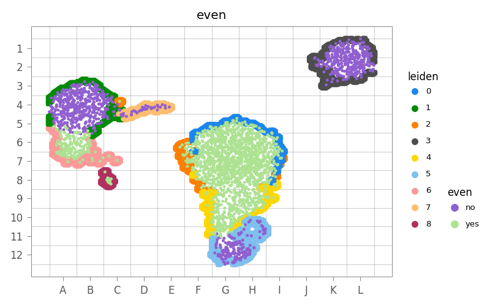
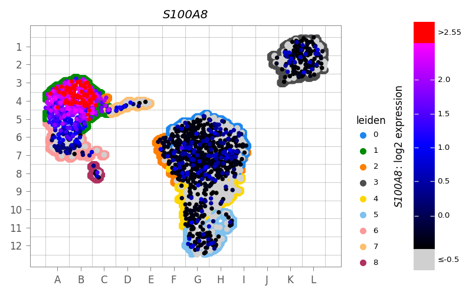

# mbf-singlecell-plotter

Publication-quality scatter plots for single-cell RNA-seq embeddings.

Built on [plotnine](https://plotnine.org) and
[AnnData](https://anndata.readthedocs.io), the library provides a fluent
builder API that covers the full rendering pipeline — gene expression,
clipped color bars, cluster annotations, cell-type boundary overlays, 
grid coordinates, density heatmaps, and grid-local histograms — 
while keeping plots from different experiments
visually comparable via fixed panel sizes.

| Categorical | Numerical |
|---|---|
|  |  |

---


## Quick start

```python
import anndata
from mbf_singlecell_plotter import ScatterPlotter

ad = anndata.read_h5ad("my_data.h5ad")
plotter = ScatterPlotter().set_source(ad, embedding="umap")

# Gene expression
plotter.plot("S100A8").save("s100a8.png")

# Categorical annotation
plotter.plot("leiden").save("leiden.png")

# Cell density
plotter.plot_density().save("density.png")
```

`ScatterPlotter` is an **immutable builder** — every method returns a new copy,
so a base plotter can be safely reused and extended.

---

## Builder API

### Data source

```python
ScatterPlotter(base_size=12)
plotter.set_source(ad_or_data, embedding="umap", layer='X', transform=lambda x: x / np.log(2))
```

`ad_or_data` can be:
- an `anndata.AnnData` object
- a path (`str` or `pathlib.Path`) to an `.h5ad` file — requires [h5ad_inspect](https://github.com/tyberiusPrime/h5ad_inspect) on `PATH`
  (and uses a fast binary to get individual rows. If this is slow, your anndata matrix is not in csc, but in csr format!)
- an `EmbeddingData` instance (skips re-wrapping)

`embedding` can be a key in `ad.obsm` (`"umap"` → `"X_umap"`) or a tuple for two PCA components:
```python
plotter.set_source(ad, embedding=("pca", 0, 1))
```

Layer within the data source (ad.layer['xyz']) can be chosen via `layer`, 'X' means the .X
instead of ad.layer['X']!

The transform is applied to X/layer derived columns only, not to .obs columns


#### Alternative / fallback sources

Register secondary sources that are consulted only when a column or gene is
missing from the primary source:

```python
plotter = plotter.add_alternative_source(other_ad)            # AnnData
plotter = plotter.add_alternative_source(H5adFacade("sub.h5ad"))  # lazy facade
plotter = plotter.add_alternative_source("genes_only.h5ad")   # path (needs h5ad-inspect)
plotter = plotter.add_alternative_source(other_embedding_data)  # reuse an EmbeddingData
```

When `plot("S100A8")` / `get_column("...")` can't resolve a name in the
primary source, each alternative is tried in registration order. The first hit
wins and its values are **reindexed onto the primary source's `obs_names`** so
they line up with the embedding — extra cells in the alternative are dropped,
and primary cells absent from the alternative become `NaN`.

Sources may be `AnnData`, `H5adFacade`, an `.h5ad` path, or another
`EmbeddingData`. The plotter is immutable, so `add_alternative_source` returns
a new copy.

#### Naming sources & explicit lookup

Give an alternative a name to address it explicitly:

```python
plotter = plotter.add_alternative_source(imputed_ad, name="imputed")
```

Then pass a `(source_name, column)` tuple to pull a column from that specific
source — bypassing both the primary and the fallback order:

```python
plotter.plot(("imputed", "S100A8"))
plotter.get_column(("imputed", "S100A8"))
```

Tuple lookups resolve from the named source only and are reindexed onto the
primary `obs_names`. Plain-string lookups keep the usual primary → fallback
behaviour. Names must be unique; passing a duplicate name raises `ValueError`.

#### Derived sources (computed columns)

Register a source whose columns are computed on demand from the primary —
or any registered alternative — source:

```python
plotter = plotter.add_derived_source({
    "double_genes": lambda d: d.get_column("n_genes").series * 2,
    "ratio": lambda d: d.get_column("n_genes").series / d.get_column("total_counts").series,
})

plotter.plot("double_genes")
```

Each callable receives the underlying `EmbeddingData` and must return a
`pandas.Series` indexed by the primary `obs_names`. Columns are recomputed on
every lookup (no caching), so they always reflect the current source state.

Give a derived source a name to address a column explicitly, bypassing both
the primary source and the fallback order:

```python
plotter = plotter.add_derived_source(
    {"score": lambda d: d.get_column("n_genes").series * 2},
    name="calc",
)

plotter.plot(("calc", "score"))
plotter.get_column(("calc", "score"))
```

Lookup order:

- plain string — checked **after** the primary source but **before** the
  alternative sources (so a derived column wins over an accidentally
  same-named column in a fallback);
- `(name, column)` — resolves from the named derived source only.

`name` must be unique among all alternative and derived sources, and results
are reindexed onto the primary `obs_names`. The plotter is immutable —
`add_derived_source` returns a new copy.

-

### Filters

You can pass in a function taking the data layer, returning a boolean `pandas.Series`
to filter the data being shown. 

```python

plotter = plotter.set_filter(lambda data: data.get_column('mouse')[0] == 'ID123')
```

This by default does not apply to the border layer, which uses the full 
dataset nevertheless. Enable border filtering with 

``` python
plotter = plotter.with_borders(respect_filter=True)
```

---

### Visual style

```python
plotter.style(
    dot_size=3,           # scatter-dot radius
    legend_dot_size=4,    # dots inside the legend
    panel_border=True,    # draw a border around the plot panel
)
```

---

### Colormap (numerical data)

```python
plotter.colormap(
    cmap=["#000000", "#0000FF", "#FF00FF"],  # list of colors (gradient), or matplotlib cmap
    max_quantile=0.95,     # values above this quantile are clipped
    upper_clip_color="#FF0000",  # color shown for clipped values
    title="log2 expr",     # custom colorbar title (None → '<gene name> log2 expression')
)
```

### Colormap (categorical data)

```python
# Positional list (cycles if there are more categories than colors)
plotter.colormap_discrete(["#E41A1C", "#377EB8", "#4DAF4A"])

# Or a dict for explicit mapping
plotter.colormap_discrete({"T cell": "#E41A1C", "B cell": "#377EB8"})
```

---

### Zero-value handling

Cells with zero expression are rendered as a separate (lower) layer so they do
not drown out the color gradient.

```python
plotter.zeros(
    color="#D0D0D0",   # color for zero dots (default: light grey)
    dot_size=3,
    max_zero_value=0.0,    # threshold treated as "zero"
)
```

---
### Outliers (categorical) 

By default, we take the 5% of each category that's the farthest
from the mean position within the category (euclidean distance), 
and plot them on top. This helps highlight bad labeling.

Adjust jusing

```python
plotter.outliers(
    shape = 'x',
    # points are outlier if they're *above* this quantile
    quantile = .95,
)
```

---
### Overplotting/anti_overplot (numerical) 

By default, we plot points in order of value, so high values end up on top.
This allows you to disable the sorting, or reverse it's order.

```python
plotter.anti_overplot(
    enabled = True, # True == default
    ascending = True, # True == default
)
```


---

### Layer visibility

You can toggle each layer individually on / off

```python
plotter.layers(
    data=True,       # main scatter layer
    zeros=True,      # zero-expression lower layer
    borders=True,    # cell-type boundary underlay
    outliers=True,   # outlier re-plot pass (categorical only)
)
```

---

### Cell-type boundaries

Gaussian-blurred masks are computed per cell type and boundaries are traced as contour lines.

```python
plotter.with_borders(
    cell_type_column="leiden",
    size=15,           # boundary dot size
    resolution=200,    # rasterisation resolution
    blur=1.1,          # Gaussian blur σ
    threshold=0.95,    # contour threshold
    legend=True,
    legend_title="Cell type",
)

plotter.without_borders()   # disable
```

---

### Grid overlay

A 12 × 12 (configurable) coordinate grid with alphanumeric labels — useful for
spatial reference across figures.

Default is to have the grid enabled.

```python
plotter.with_grid(
    labels=True,            # draw "A1", "B3" … inside each cell
    coords=True,            # replace axis ticks with grid coordinates
    vertical_letters=False, # True → letters on y-axis, numbers on x-axis
    grid_size=12,           # cells per axis (max 26)
    color="#777777",
    label_color="#777777",
)

plotter.without_grid()   # disable
```

---

### Fixed panel size

Fixes the **data area** (the actual scatter region, excluding legend and
labels) to exact dimensions in inches. Figure size adjusts to fit the
decorations, so plots with different legends remain directly comparable.

```python
plotter.panel_size(width=3.0, height=3.0)
```

Works for both `.plot()` and `.plot_grid_histogram()`.

---

### Viewport

```python
plotter.focus_on(x=(x_min, x_max), y=(y_min, y_max))
plotter.focus_on_grid("G3", "H12")
plotter.unfocus()
```

---

### Faceting

```python
plotter.facet("batch", n_col=3, dir='v')
plotter.unfacet()
```

Facet by two variables into a grid (`facet_grid(row ~ col)`):

```python
plotter.facet_2d(row_variable="donor", col_variable="tissue")
```

`facet()` and `facet_2d()` are mutually exclusive — each unsets the other.

In a 2-D grid the row labels live on the right, between the panels and the
colour bar. They are rotated 90° automatically so they don't crowd that gap
(override with `.theme(strip_text_y=...)`).

---

### Title

```python
plotter.title("My custom title")  # or None to suppress
```

---

## Terminal methods

```python
# Scatter plot (auto-detects numerical vs. categorical)
p = plotter.plot("S100A8")
p = plotter.plot("leiden")

# 2-D cell density heatmap
p = plotter.plot_density(bins=200, quantile=0.99)

# Grid-local category frequency histogram
p = plotter.plot_grid_histogram("leiden", min_cell_count=10)

```

All terminal methods return a `plotnine.ggplot` object; call `.save()` on it or
pass it to any plotnine-aware function.

---

## Recipes

### Numerical plot with boundaries and grid

```python
plotter = (
    ScatterPlotter()
    .set_source(ad, embedding="umap")
    .style(dot_size=2)
    .with_borders(cell_type_column="leiden")
    .with_grid(labels=True)
    .zeros(zero_value=-0.5)
    .colormap(max_quantile=0.99)
)

plotter.plot("S100A8").save("s100a8_full.png")
```

### Consistent panel size across multiple genes

```python
base = (
    ScatterPlotter()
    .set_source(ad)
    .style(dot_size=2)
    .panel_size(3.0, 3.0)
)

for gene in ["S100A8", "LST1", "CST3"]:
    base.plot(gene).save(f"{gene}.png")
```

### Faceted plot per cluster

```python
(
    ScatterPlotter()
    .set_source(ad)
    .facet("leiden", n_col=3)
    .style(dot_size=1)
    .plot("S100A8")
    .save("faceted.png")
)
```

### Grid-local histogram with vertical letters

```python
(
    ScatterPlotter()
    .set_source(ad)
    .with_grid(vertical_letters=True)
    .plot_grid_histogram("leiden", min_cell_count=10)
    .save("grid_hist.png")
)
```

---

## Loading directly from .h5ad files

When [h5ad_inspect](https://github.com/tyberiusPrime/h5ad_inspect) is
installed, you can pass a file path to `set_source` instead of loading the
full dataset into memory first:

```python
plotter = ScatterPlotter().set_source("my_data.h5ad", embedding="umap")
plotter.plot("S100A8").save("s100a8.png")
```

Only the data actually needed for each plot is read from disk — obs columns
and gene-expression vectors are fetched on demand, and embedding arrays are
read via `h5ad-inspect`'s `--binary` mode.  This is useful for large datasets
where loading the full AnnData into RAM is slow or impractical.

### Installation

```bash
# Cargo (Rust toolchain required)
cargo install --git https://github.com/TyberiusPrime/h5ad_inspect

# Nix devShell — add to your flake packages:
# h5ad_inspect.packages.${system}.h5ad-inspect
```

### Feature detection

```python
from mbf_singlecell_plotter import is_h5ad_inspect_available

if is_h5ad_inspect_available():
    plotter.set_source("my_data.h5ad", embedding="umap")
else:
    import anndata
    plotter.set_source(anndata.read_h5ad("my_data.h5ad"), embedding="umap")
```

### Early analysis (no embedding yet)

`H5adFacade` is exported as a top-level name so you can use it directly
before any embedding has been computed.  It gives you lazy, on-demand access
to `obs` annotations and gene expression without loading the whole file:

```python
from mbf_singlecell_plotter import H5adFacade

ad = H5adFacade("my_data.h5ad")

# Inspect available obs columns
print(list(ad.obs.columns))

# Read a single obs column (fetched on demand, then cached)
leiden = ad.obs["leiden"]

# Read a gene-expression vector
series = ad.obs["n_counts"]  # any obs column
expr = ad.X[:, ad.var_names.get_loc("S100A8")]  # gene by integer index

# Once embeddings are added, pass it straight to EmbeddingData
from mbf_singlecell_plotter import EmbeddingData
data = EmbeddingData(ad, embedding="umap")
```

### What is supported

`H5adFacade` implements the same interface as `AnnData`:

| Attribute | Description |
|---|---|
| `obs_names` / `var_names` | cell and gene indices |
| `obs[key]` | obs columns — numeric, bool, or categorical |
| `var.index` / `var[key]` | gene index and var columns |
| `obsm[key]` | embedding arrays |
| `X[:, i]` | gene-expression column by integer position |
| `get_X_csr()` | full `X` as a scipy CSR matrix (bulk access; used by Moran's I) |

Columns are cached after the first access, so repeated `get_column` calls for
the same gene or annotation do not re-invoke `h5ad-inspect`. `get_X_csr()`
loads the whole matrix in one `export matrix_csr` call and is the fast path
for analyses that touch every gene at once; `X[:, i]` stays cheap for the
common single-gene plotting case.

---

## Data layer

`EmbeddingData` is the pure-data backbone of the library. It wraps an
`AnnData` object together with an embedding choice and exposes column
lookup, coordinate extraction, viewport management, and grid-mapping — all
without touching plotnine or matplotlib.

```python
from mbf_singlecell_plotter import EmbeddingData, ColumnData
```

### Construction

```python
data = EmbeddingData(
    ad,                             # anndata.AnnData
    embedding="umap",               # str key in ad.obsm, or ("pca", col1, col2) tuple
    alternative_id_column=None,     # ad.var column to use as a secondary gene lookup key
    alternative_sources=None,       # list of fallback AnnData/H5adFacade/path sources
    grid_size=12,                   # cells per axis (max 26)
    grid_letters_on_vertical=False, # True → numbers on x-axis, letters on y-axis
)
```

`embedding` resolution order:
1. Exact key in `ad.obsm` (e.g. `"X_umap"`).
2. `"X_" + key` (e.g. `"umap"` → `"X_umap"`).
3. Tuple `("pca", 0, 1)` — picks columns 0 and 1 from the named array.

```python
# Register fallback sources imperatively (returns a new EmbeddingData)
data = data.add_alternative_source(other_ad, name="imputed")  # name optional
```

Named sources can be addressed explicitly via `get_column((name, column))`;
plain-string lookups fall back through every registered alternative.

### Derived sources (computed columns)

Register a source whose columns are computed on demand — the callables may
pull from the primary source or any registered alternative via `get_column`
and combine the results:

```python
data = data.add_derived_source({
    "double_genes": lambda d: d.get_column("n_genes").series * 2,
    "ratio": lambda d: d.get_column("n_genes").series / d.get_column("total_counts").series,
})

# Or pass a name for explicit tuple routing
data = data.add_derived_source(
    {"score": lambda d: d.get_column("n_genes").series * 2},
    name="calc",
)
data.get_column(("calc", "score"))
```

`derived` is a `{column_name: callable}` mapping; each callable receives the
`EmbeddingData` and returns a `pandas.Series` indexed by the primary
`obs_names`. Columns are recomputed on every lookup (no caching).

Resolution order for plain-string names:

1. Primary source
2. **Derived sources** (checked before alternatives, so a derived column
   wins over an accidentally same-named column in a fallback)
3. Alternative sources

Tuple routing `get_column((name, column))` resolves from the named derived
(or alternative) source only. `name` must be unique among all alternative and
derived sources, and results are reindexed onto the primary `obs_names`.

`EmbeddingData` is immutable — `add_derived_source` returns a new copy.
Registered derived sources are exposed via `EmbeddingData.derived_sources`
as `DerivedSource(name, columns)` named tuples.

#### `DerivedSource`

```python
from mbf_singlecell_plotter import DerivedSource  # NamedTuple

rec = DerivedSource("calc", {"score": lambda d: d.get_column("n_genes").series})
data = EmbeddingData(ad, "umap").add_derived_source(rec)

rec.name      # Optional[str] — None for plain-string-only sources
rec.columns   # Dict[str, Callable[[EmbeddingData], pd.Series]]
```

---

### `get_column(name)` → `ColumnData`

Retrieve any observation-level value by name.  Returns a
`ColumnData(series, name)` named tuple where `series` is a `pd.Series`
indexed by `ad.obs_names`.

```python
col = data.get_column("leiden")   # obs column
col = data.get_column("S100A8")   # gene from ad.X
series, label = col               # unpack like a named tuple
```

Resolution order:

| Priority | Source | Condition |
|---|---|---|
| 1 | `ad.obs[name]` | name is a column in obs |
| 2 | `ad.var.index` | exact match |
| 3 | `ad.var[alternative_id_column]` | if `alternative_id_column` was set and yields exactly one hit |
| 4 | `ad.var.index` prefix `"<name> "` | when var index contains space-separated `"<name> <id>"` pairs |
| 5 | `ad.var.index` suffix `" <name>"` | when var index contains space-separated `"<id> <name>"` pairs |

Raises `KeyError` if no match is found.

If nothing matches in the primary source, **derived sources** are checked
next (see `derived_sources` / `add_derived_source`), then each registered
alternative source (see `alternative_sources` / `add_alternative_source`)
is tried with the same resolution order; the first hit is reindexed onto
the primary `obs_names`.

For explicit routing, pass a `(source_name, column)` tuple — the column is
resolved from the alternative or derived source registered under
`source_name` only.

#### `AlternativeSource`

```python
from mbf_singlecell_plotter import AlternativeSource  # NamedTuple
```

Each registered fallback is exposed as an `AlternativeSource(name, ad)` named
tuple via `EmbeddingData.alternative_sources`. `name` is `None` for sources
that participate only in the automatic fallback search.

#### `ColumnData`

```python
from mbf_singlecell_plotter import ColumnData  # NamedTuple

col.series   # pd.Series — values indexed by obs_names
col.name     # str — the resolved display name
```


--

---

### Coordinates

```python
df = data.coordinates()   # pd.DataFrame with columns ["x", "y"], indexed by obs_names
```

---

### Viewport (focus)

`EmbeddingData` is immutable — viewport methods return a **new** instance.

```python
# Coordinate ranges
zoomed = data.focus_on(x=(x_min, x_max), y=(y_min, y_max))

# Grid labels (e.g. top-left "A1" to bottom-right "C5")
zoomed = data.focus_on("A1", "C5")

# Remove focus
full = zoomed.unfocus()

data.has_focus   # bool — True if a focus is active
```

---

### Bounds

```python
data.bounds()       # (x_min, x_max, y_min, y_max) — focus-aware
data.full_bounds()  # same, always from the full data range
```

---

### Grid helpers

```python
# Label for a single coordinate pair (e.g. "G3")
label = data.grid_coordinate(x, y)

# Labels for every cell — pd.Series indexed by obs_names
labels = data.grid_coordinates()

# Tick positions and labels for grid axes
x_pos, y_pos, x_labels, y_labels = data.grid_labels()

data.grid_size   # int — cells per axis
```

---

### Analysis helpers

```python
# Median x/y position + grid label per cluster category
centers = data.cluster_centers("leiden")
# → pd.DataFrame with columns ["x", "y", "grid"], index = category names

# Spatially coherent marker genes per UMAP region (Moran's I)
markers = data.moran_markers(n_bins=40, min_cells=3, k=20, min_moran=0.2)
# → dict mapping (xi, yi) bin-index tuple → list of gene names

# Grid-local category frequency histogram
hist = data.grid_local_histogram("leiden", min_cells=10)
# → pd.DataFrame with columns ["x", "y", "category", "frequency", "total"]
```

---

## Low-level API

The transform functions and theme helpers are also importable directly:

```python
from mbf_singlecell_plotter import (
    EmbeddingData,
    ColumnData,
    AlternativeSource,
    DerivedSource,
    prepare_scatter_df,
    prepare_density_df,
    compute_boundaries,
    DEFAULT_COLORS_BORDERS,
    DEFAULT_COLORS_CATEGORIES,
    embedding_theme,
    sc_guide_colorbar,
)
```

`embedding_theme()` returns the base plotnine theme used by all plots.
`sc_guide_colorbar` is the custom colorbar guide with optional zero/clip
extension boxes.

---

## Development

```bash
# Install with dev dependencies
pip install -e ".[dev]"

# Run tests
pytest tests/

# Regenerate reference images after visual changes
REGENERATE_REFS=1 pytest tests/test_images.py
```

Tests are split into fast unit tests (`test_unit.py`) and pixel-level image regression tests (`test_images.py`). The image tests save reference PNGs to `tests/reference_images/` on first run and diff against them on subsequent runs.
